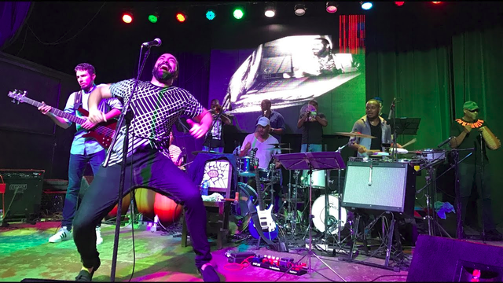
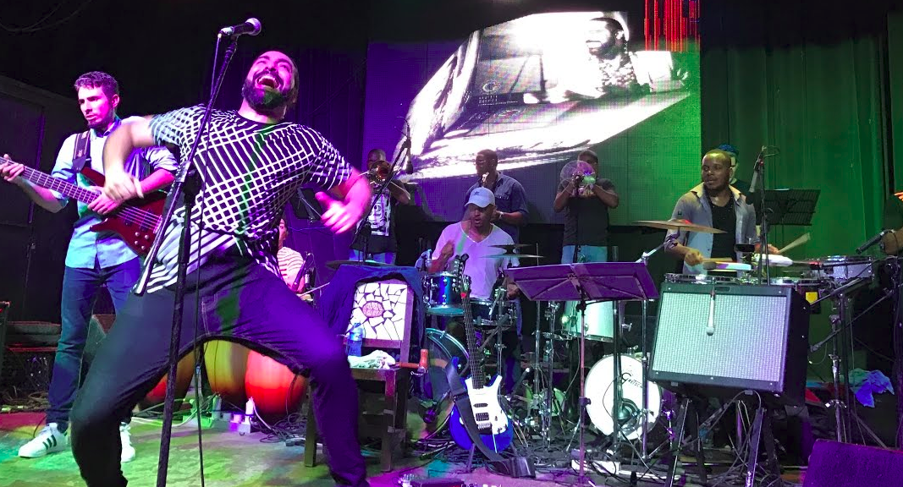
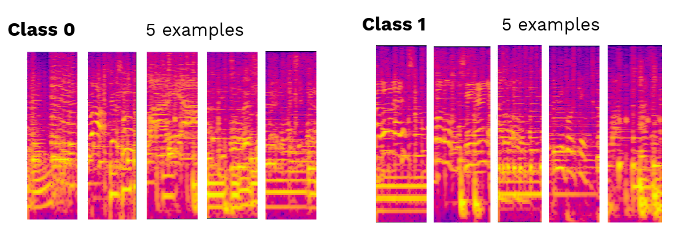

# Timba Gear Detection

### TL;DR:
- Timba is an intensely complex and energetic genre of Cuban music originating in the 90s It's under very active academic study, but has almost no hard data available for research. 
 
- This project attempts to recognize specific categories of rhythm section patterns by employing CNN image classification on spectrograms rendered from small audio chunks. 
 
- The accuracy of the most recent test on unseen data was 81%. 
 
- This is part of a larger ongoing project aimed at automatically transcribing the musical content in timba.
 

## Contents
- [Context](#context)
  - What is timba?
  - What are gears?
- [Goals/Uses](#Goals/uses)
- [Data Preparation](#Data-Preparation)
  - [Class Imbalance](#Class-Imbalance)
  - [Class Similarity](#Class-Similarity)
- [Process](#Process)
- [Performance](#Performance)
- [Future Work](#Future-Work)

## Context

**What is Timba?**
The [Special Period](https://en.wikipedia.org/wiki/Special_Period) in Cuba in the 90s brought about a kind of musical renaissance, which had been slowly brewing for the previous couple of decades (driven primarily by [Los Van Van](https://www.youtube.com/watch?v=KKa3YZulvt0)). In this explosion of musical creativity Timba was born - a genre with an astonishing combination of complexity and raw energy - and has been under active study ever since. 
 

_Note: if you're wondering why you've never heard of timba - the average Cuban at the time would have had to save nearly a month's wages to buy a single CD, so what was recorded in the studio was 100% intended for non_cuban audiences, and the government at the time insisted on recording a very simplified, low-energy version of timba_

**What are gears?** 
 

Gears - which are the main subject of this project - are collective patterns played by the entire rhythm section. To give an example using american pop music: the rhythm section -  bass, drums, guitar, and keyboard - might play one set of patterns during a song's verse, then collectively change to new patterns for the chorus. We might call these the 'verse' and 'chorus' gears. Timba has between 8 and 10 of these gears (depending on the band).
 

Here are a few examples of the categories of gears used in this project:
 

**Marcha** (class 0) - 'normal' bread-and-butter category of gears, most verses, choruses, brass sections, etc. 

[Marcha Example 1](https://youtu.be/NOEjQKs6hpQ) [Marcha Example 2](https://youtu.be/u6Y2SSHUEYA)
**Despelote** (class 1) - breakdown gears, super quiet, super loud, high-energy sections unique to timba
 

[Despelote Example 1](https://youtu.be/aUV7MBnhl7w) [Despelote Example 2](https://youtu.be/yrfO9gy-Nxg)
 

## Goals/Uses
Why would detecting gears be useful? For a few reasons:
- it takes a lot of musical training and experience to identify these gears by ear
- very little music has been labelled by gear (at all, let alone in a way that's usable for data-based research)
- automatically doing this labelling could remove a lot of the human work hours required to build larger datasets
  - opens the possibility of doing high-level research up to people with less musical training
  - creates the potential for more data-based research in the future
   
  
This project and the datasets it will be able to create also fit into a larger project of mine, aimed at auto-transcription of of timba and other Cuban music.
 

## Data Preparation

The data preparation process for this project was a fair bit more of a task than I had expected, but I eventually got it down to a relatively straightforward pipeline - though it does require a fair bit of human work (underlining the potential usefulness of an effective classification model).
 
After choosing songs to analyze, I got high quality audio versions, split each song into 2-beat long chunks, and categorized those chunk by listening through and manually. As a bit of a bias check, I validated my classification of the chunks by submitting them to some academic peers in the field. 
I chose to start by categorizing gears into 2 broad categories instead of the full 9 classes, to make sure I wasn't overreaching.
 

### Class Imbalance
At this point one issue became clear. I thought it was important to choose songs from a diverse set of artists for my dataset, so that my model would generalize well on future data, but different artists used these two categories of gears for very different amounts of time in their songs, with ratios ranging from 1:1 to nearly 10:1.
With the songs I chose I ended up having to leave around 40% of my labeled data unused in order to have balanced classes.
 

Because each song is a different tempo and therefore each 2-beat chunk 
is a different number of milliseconds long, I decided a good approach 
would be to render each chunk of audio as a spectrogram, and use a convolutional neural network to classify those images.
 

### Class Similarity
Once I prepared all my data, it became very clear that this was not an 
easy image classification problem. Here are 5 randomly chosen examples from each class - visually it's clear that there is at least as much variation **within** the classes as **between** them.

 

## Peformance
My first CNN, which I trained with 400 data points, didn't perform that well, getting an accuracy score only barely better than random chance. 
So I spent some hours listening through some more songs and 
labeling some more data, and retraining the network on 600 examples significantly improved performance. 

For some context, I asked 4 humans to attempt the same task - 2 of them were expert musicians, who I explained the two categories to verbally, and 2 of them were subject-matter experts in timba. Only 1 out of 4 managed a score above 50%.
~[bar chart showing performance - 4 experts with 35, 45, 45, 55 % accuracy; 400-sample model with 53 % accuracy, 600-sample model with 81% accuracy](images/performance.png)
 

So on the one hand, the model does surprisingly well compared to human experts, and on the other hand these very low scores outline a very important difference between how an expert would approach this task and how the model is being forced to approach it.
 

## Future Work
**So how can the model perform better?**

- More data
This is possibly the most clearest solution. Not only is 600 data points a very small dataset to expect to train an accurate image classifier on, but the fact that the accuracy between 400 and 600 samples improved by 
28% suggests that this may well be the most effective way forward.

- More classes
Lumping gears into these 2 broad categories is technically correct as far as academic analysis is concerned, but as we saw earlier the variation within those 2 classes is huge, and this could be reduced very effectively by breaking the chunks into the much more specific 9 classes.

- More context
Lastly, as I realized when the experts I asked got such low scores, humans use much more than 2 beats worth of context to approach the same classification task, so I'd like to try retraining the network on 8 to 16 beat chunks, which would still be labeled by the middle 2 beats.

